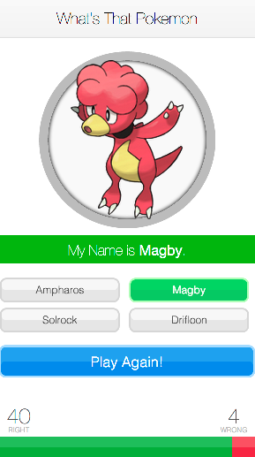

What's That Pokemon
===============

Match the silhouette of the Pokemon to one of the given Pokemon names. [Try it now](http://htmlpreview.github.io/?https://github.com/k39chen/ColorGame/blob/master/index.html)!

Usage
------------

To play **What's That Pokemon** [click here](http://htmlpreview.github.io/?https://github.com/k39chen/AnimeRecord/blob/master/index.html).

Credits
-------------
Special thanks goes to Paul Hallett, developer of [http://pokeapi.co/](http://pokeapi.co/) whose API was used extensively throughout the course of this project.

Special thanks goes to the Meteor team. Enjoyed the use of the [Meteor JS Framework](http://www.meteor.com/).

License
-------------
Copyright (c) 2013 Kevin Chen.
